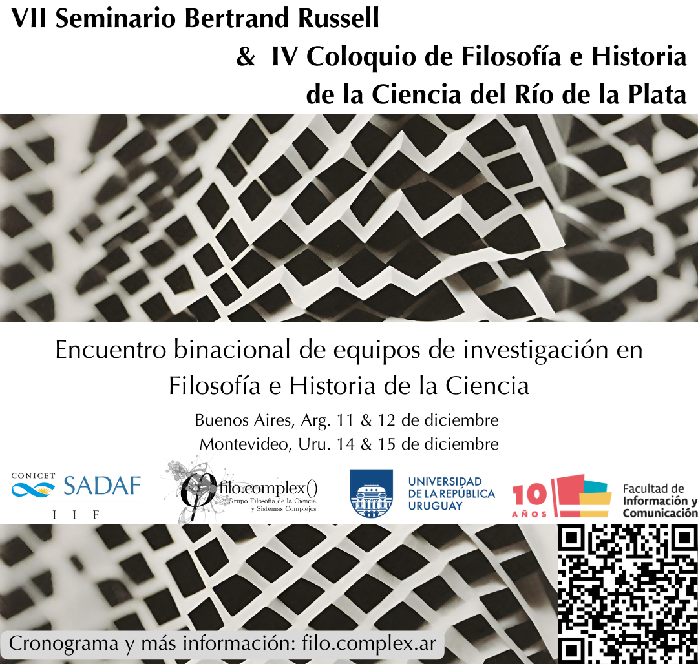

## Encuentro binacional de equipos de investigación en Filosofía e Historia de la Ciencia

## Cronograma

## Lunes 11

#### Sede Buenos Aires
#### Sociedad Argentina de Análisis Filosófico
Bulnes 642 CABA

> 9:30-10:00. Palabras de apertura.
>
> 10:00 - 10:45. *Medidas de complejidad y cambio de teorías*
>
> **Miguel Fuentes & Hernán Miguel** (SADAF, Argentina - Universidad de
> Buenos Aires, Argentina)
>
> 11:00 - 11:45. *La broma infinita: una perspectiva no fundacionista para la ciencia de la información*
>
> **Ignacio Saraiva** (Universidad de la República, Uruguay)
>
> 12:00-12:45. *Explicaciones causales a partir de modelos. Modelo dinámico para decisiones políticas*
>
> **Leandro Giri & Hernán Miguel** (Universidad Tres de Febrero,
> Argentina - Universidad de Buenos Aires, Argentina)
>
> 13:00-15:00. Almuerzo.
>
> 15:00-15:45. *IA y Sistemas Complejos: contextos históricos en su desarrollo* 
> **Andrés Ilcic & Miguel Fuentes** (SADAF, Argentina)

## Martes 12

#### Sede Buenos Aires
#### Sociedad Argentina de Análisis Filosófico
Bulnes 642 CABA

> 10:00 - 10:45. *Aplicación a la IA y las propiedades emergentes*
>
> **Erick Rubio & Andrés Ilcic** (Universidad del Atlántico, Colombia -
> SADAF, Argentina)
>
> 11:00 - 11:45. *IA: otro desafío para la filosofía de la técnica*
>
> **Agustín Courtoisie** (Universidad de la República, Uruguay)
>
> 12:00 - 12:45. *Ciencia y tecnología entendidas como un sistema complejo. Comunicación pública de la ciencia y la tecnología, y los  sujetos de la acción comunicativa*
>
> **Marcelo Rodríguez & Leandro Giri** (SADAF, Argentina)
>
> 13:00-15:00. Almuerzo
>
> 15:00 - 15:45. *Modelización y Teoría de Redes: Aplicación a Educación*
>
> **Ada Czerwonogora & Miguel Fuentes** (UCLAEH, Uruguay - SADAF,
> Argentina)

## Jueves 14

####  Sede Montevideo
#### Facultad de Información y Comunicación
San Salvador 1944

> 9:30-10:00. Palabras de apertura.
>
> 10:00 - 10:45. *Comunicación de la ciencia: ¿Por qué? ¿Para qué? ¿Para quiénes?*
>
> **Jorge Rasner** (Universidad de la República, Uruguay)
>
> 11:00 - 11:45. *El problema de la demarcación y su relación con la comunicación mediática*
> **Alejandro Paiva** (Universidad de la República, Uruguay)

>
> 12:00 - 12:45. *Sistemas Complejos y Causación Internivel. Modelos de aprendizaje para IA* 
> 
> **Hernán Miguel y Miguel Fuentes** (SADAF, Argentina) 
>
> 13:00 - 16:00. Almuerzo
>
> 16:00 - 16:45.  *Fusión de lenguajes: IA en la investigación social*
> **Soledad Caballero** (Universidad de la República, Uruguay)
>

## Viernes 15

#### Sede Montevideo
#### Facultad de Información y Comunicación
San Salvador 1944

> 10:00 - 10:45. *Conciencia, atención y percepción*
>
> **Ignacio Cervieri** (Universidad de la República, Uruguay)
>
> 11:00 - 11:45. *Fundamentos de la Epistemocrítica: un encuentro entre Literatura y Ciencia*
>
> **Mauricio Cheguhem** (Universidad de la República, Uruguay)
>
> 12:00 - 12:45. *La cultura visual de la medicina alternativa en el Uruguay del Novecientos*
>
> **Analía Lavín** (Universidad de la República, Uruguay)
>
> 13:00 - 16:00. Almuerzo
>
> 16:00 - 16:45. *Metafísica de la ciencia en el Río de la Plata*
>
> **Bruno Borge** (Universidad de Buenos Aires, Argentina)
> 
> *Presentación de la serie audiovisual accesible Epistemología Abierta*
>
> **Victoria Lavorerio, Ignacio Bruné, Santiago Ferro, Magela Rodríguez**

**Coordinación**: Hernán Miguel, Leandro Giri y Mauricio Cheguhem.

**Contacto:**

* [coloquiofhc@fic.edu.uy](mailto:coloquiofhc@fic.edu.uy)

* [mauricio.cheguem@fic.edu.uy](mailto:mauricio.cheguem@fic.edu.uy)

# Organizan:

> Grupo de Estudios Sociales de la Ciencia y la Tecnología (GESCyT)
> Universidad de la República, Uruguay.

> Grupo Filosofía de la Ciencia y Sistemas Complejos (filo.complex)
> Sociedad Argentina de Análisis Filosófico (SADAF).

