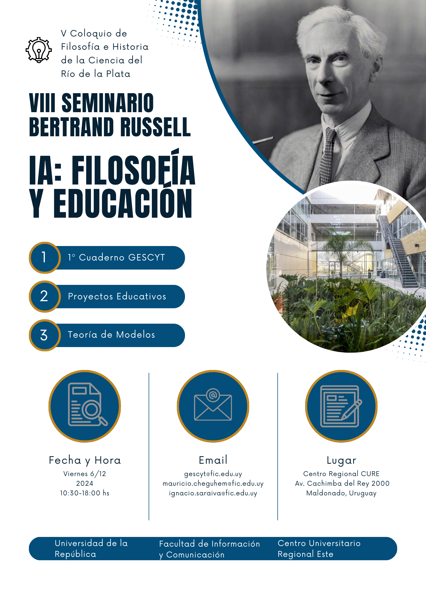

## Encuentro binacional de equipos de investigación en Filosofía e Historia de la Ciencia

## Cronograma

#### Viernes 6/12

#### Sede Maldonado, Uruguay

**Inteligencia Artificial: Filosofía y Educación**

> CURE: Centro Universitario Regional del Este
Sede Maldonado
Salón 1
AV. Cachimba del Rey entre Bv. Artigas y Av. Aparicio Saravia

10:00 - 10:30. Palabras de apertura y recepción
**Ignacio Saraiva (FIC, UDELAR)**

10:30 - 11:00. Mesa redonda I: “Presentación del 1er cuaderno del Gescyt”
**Jorge Rasner (FIC, UDELAR) & Agustín Courtoisie (FIC, UDELAR).**

11:00 - 12:30. Mesa redonda II (híbrida): “Desafíos actuales de la Inteligencia
Artificial”
**Javier Echeverría (Universidad Politécnica de Madrid, España), Lola S.
Almendros (CSIC, España), Jorge Rasner (FIC, UDELAR) & Ignacio Cervieri
(FIC, UDELAR).**

12:45 - 13:30. “Cuando el jefe es una IA: un análisis filosófico de las plataformas de changas”
**Leandro Giri (UBA, SADAF, Argentina)**

13:30 - 15:00. Almuerzo.

15:00 - 15:45. “Formación docente, sistema educativo y tecnologías entrañables”
**Hernán Miguel (UBA, SADAF, Argentina)**

16:00 - 16:45. “¿La inteligencia artificial cancela el futuro? Un aporte desde el
estudio de las narrativas audiovisuales digitales”
**Santiago López Delacruz (FIC, UDELAR)**

16:45 - 17:30. “Inteligencia artificial: diálogo de casos y caminos teóricos”
**Agustín Courtoisie (FIC, UDELAR)**

17:30. Palabras de cierre
**Mauricio Cheguhem (FIC, UDELAR)**

## Sede Buenos Aires, Argentina

### Lunes 9

|   |   |
|---|---|
10:00 - 11:00 | Mauricio Cheguhem | Literatura y ciencia: de la anticipación a la teoría adaptativa en la ficción climática rioplatense
11:00 - 12:00 | Andrés Ilcic | Gobernanza e inteligencia artificial: Una mirada desde los sistemas complejos
12:00 - 13:00 | Alejandro Paiva | Notas sobre el problema de la demarcación
13:00 - 15:00 | - | Almuerzo |
15:00 - 16:00 | Marcelo Rodríguez | Racionalidades científicas y racionalidades de la comunicación: posverdad y redes sociales
16:00 - 17:00 | Ignacio Saraiva | Reconstrucción paradigmática y teórica en ciencia de la información: el caso de la recuperación de la información
17:00 - 18:00 | Griselda Ríos | Transmisión social del significado

### Martes 10

|  |  |
|------|---------|-------|
| 10:00 - 11:00 | **Virginia y Gregory Chaitin** | La inexistencia de método único en las ciencias y en las matemáticas |
| 11:00 - 12:00 | **Miguel Fuentes** | Virtual: TBA |
| 12:00 - 13:00 | **Ada Czerwonogora** | Educación y Redes II |
| 13:00 - 14:00 | - | Almuerzo |
| 15:00 - 16:00 | **Eric Rubio, Sara Alarcón y Leandro Giri** | Redes Neuronales Artificiales como dispositivos de regulación en el capitalismo digital |
| 16:00 - 17:00 | **Juan Javier Nahabedian** | Certeza en tiempos de redes sociales: una crítica al binarismo epistémico |
| 17:00 - 18:00 | **Matías Giri** | Los planetas según Cicerón, Grosseteste y Galileo: una historia de cambio conceptual |

**Coordinación**: Hernán Miguel, Leandro Giri y Mauricio Cheguhem.

**Contacto:**

* [coloquiofhc@fic.edu.uy](mailto:coloquiofhc@fic.edu.uy)

* [mauricio.cheguem@fic.edu.uy](mailto:mauricio.cheguem@fic.edu.uy)

# Organizan:

> Grupo de Estudios Sociales de la Ciencia y la Tecnología (GESCyT)
> Universidad de la República, Uruguay.

> Grupo Filosofía de la Ciencia y Sistemas Complejos (filo.complex)
> Sociedad Argentina de Análisis Filosófico (SADAF).

