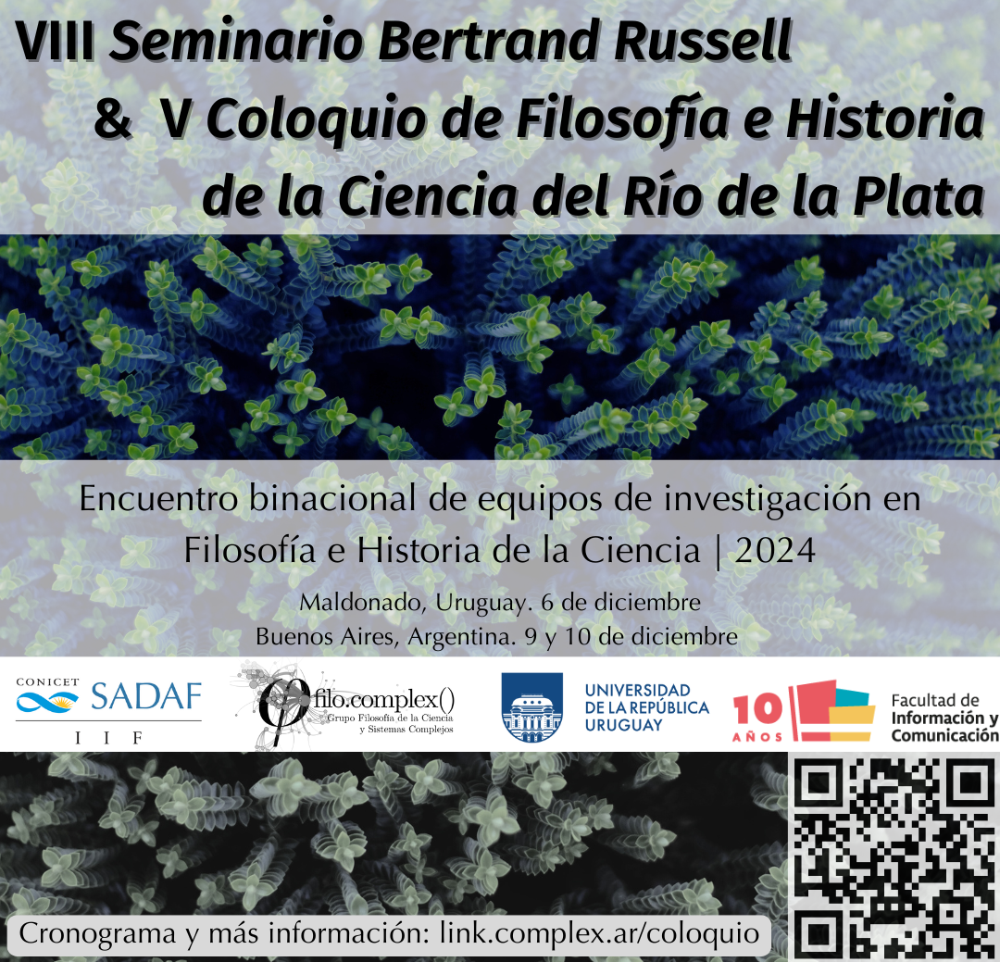

## Encuentro binacional de equipos de investigación en Filosofía e Historia de la Ciencia

El evento se realizará de manera híbrida. Para participar de manera remota y estar al tanto de las novedades [hay que registrarse en este formulario](https://forms.gle/u3SXmyL67ECoQf7m6). Enviaremos los enlaces a la sala virtual antes de cada sesión.

### Cronograma

#### Viernes 6/12

#### Sede Maldonado, Uruguay

**Inteligencia Artificial: Filosofía y Educación**

> CURE: Centro Universitario Regional del Este
Sede Maldonado, Salón 1
AV. Cachimba del Rey entre Bv. Artigas y Av. Aparicio Saravia

|  |  |  |
|------|-----|-------------- |
| 10:00 - 10:30 | Ignacio Saraiva (FIC, UDELAR) | Palabras de apertura y recepción |
| 10:30 - 11:00 | Jorge Rasner (FIC, UDELAR), Agustín Courtoisie (FIC, UDELAR) | Mesa redonda I: “Presentación del 1er cuaderno del Gescyt” |
| 11:00 - 12:30 | Javier Echeverría (Universidad Politécnica de Madrid, España), Lola S. Almendros (CSIC, España), Jorge Rasner (FIC, UDELAR), Ignacio Cervieri (FIC, UDELAR) | Mesa redonda II (híbrida): “Desafíos actuales de la Inteligencia Artificial” |
| 12:45 - 13:30 | Leandro Giri (UBA, SADAF, Argentina) | “Cuando el jefe es una IA: un análisis filosófico de las plataformas de changas” |
| 13:30 - 15:00 | - | Almuerzo |
| 15:00 - 15:45 | Hernán Miguel (UBA, SADAF, Argentina) | “Formación docente, sistema educativo y tecnologías entrañables” |
| 16:00 - 16:45 | Santiago López Delacruz (FIC, UDELAR) | “¿La inteligencia artificial cancela el futuro? Un aporte desde el estudio de las narrativas audiovisuales digitales” |
| 16:45 - 17:30 | Agustín Courtoisie (FIC, UDELAR) | “Inteligencia artificial: diálogo de casos y caminos teóricos” |
| 17:30 | Mauricio Cheguhem (FIC, UDELAR) | Palabras de cierre |

### Sede Buenos Aires, Argentina

> Sociedad de Análisis Filosófico (SADAF)
> Bulnes 642, CABA.
> 
### Lunes 9/12

|   |   |   |
|------|-----|-------------- |
| 10:00 - 11:00 | Mauricio Cheguhem | Literatura y ciencia: de la anticipación a la teoría adaptativa en la ficción climática rioplatense |
| 11:00 - 12:00 | Andrés Ilcic | Gobernanza e inteligencia artificial: Una mirada desde los sistemas complejos |
| 12:00 - 13:00 | Alejandro Paiva | Notas sobre el problema de la demarcación |
| 13:00 - 15:00 | | Almuerzo | 
| 15:00 - 16:00 | Marcelo Rodríguez | Racionalidades científicas y racionalidades de la comunicación: posverdad y redes sociales |
| 16:00 - 17:00 | Ignacio Saraiva | Reconstrucción paradigmática y teórica en ciencia de la información: el caso de la recuperación de la información |
| 17:00 - 18:00 | Griselda Ríos | Transmisión social del significado

### Martes 10/12

|  |  |   |
|------|-----|-------------- |
| 10:00 - 11:00 | Virginia y Gregory Chaitin | La inexistencia de método único en las ciencias y en las matemáticas |
| 11:00 - 12:00 | Miguel Fuentes | TBA |
| 12:00 - 13:00 | Ada Czerwonogora | Educación y Redes II |
| 13:00 - 14:00 |  | Almuerzo |
| 15:00 - 16:00 | Eric Rubio, Sara Alarcón y Leandro Giri | Redes Neuronales Artificiales como dispositivos de regulación en el capitalismo digital |
| 16:00 - 17:00 | Juan Javier Nahabedian | Certeza en tiempos de redes sociales: una crítica al binarismo epistémico |
| 17:00 - 18:00 | Matías Giri | Los planetas según Cicerón, Grosseteste y Galileo: una historia de cambio conceptual |

**Coordinación**: Hernán Miguel, Leandro Giri y Mauricio Cheguhem.

**Contacto:**

* [coloquiofhc@fic.edu.uy](mailto:coloquiofhc@fic.edu.uy)

* [mauricio.cheguem@fic.edu.uy](mailto:mauricio.cheguem@fic.edu.uy)

> Para participar de manera remota y estar al tanto de las novedades [hay que registrarse en este formulario](https://forms.gle/u3SXmyL67ECoQf7m6).

# Organizan:

> Grupo de Estudios Sociales de la Ciencia y la Tecnología (GESCyT)
> Universidad de la República, Uruguay.

> Grupo Filosofía de la Ciencia y Sistemas Complejos (filo.complex)
> Sociedad Argentina de Análisis Filosófico (SADAF).

